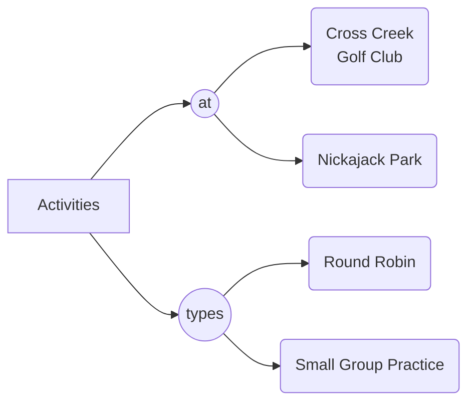

# Activity

## Round Robin

The DUPR Pickleball Round Robin event provides an organized way for players to play games and submit their scores to DUPR.

- Scores of each game is summited to mydupr.com. 
- The scores of each game is independent of other games.
- The current participating players have approximate ratings ranging from 3.0 to 4.0.

### Round Robin Shootout

- Players are assigned to courts based on their ratings from low to high.
- Each court has 4 - 6 players.
- After each set of round robin games, top 2 players move up 1 court, bottom 2 players move down 1 court.
- Rotating-Partner: Players play with different partners from one game to another.
- The **shootout** format is used when we have **8 or more** player.

| Location | Date and Time |
| ----------- | ----------- |
| Cross Creek Golf Club | Sundays, 11 a.m. to 1 p.m. |
| Nickajack Park | Tuesdays, 6 to 8:30 p.m. |

### Rotating-Partner Round Robin

Rotating-Partner Round Robin format is used when there are less than 8 players. 

## Signing Up
- Sign up for round robin events at [Playtime Scheduler](https://playtimescheduler.com/).  
- Players are required to register with [DUPR](https://mydupr.com/) before participating in the round robin events. 

## Activities in Consideration

### Drill Practice
During a **drill practice**, we perform 
- drills
- practice games focusing on specific skills
- peer-coaching.

### Game Practice

The **game practice** offers opportunities for players to 
- practicing pickleball skills and strategies while playing a game, rather than wining a particular game
- practicing for tournament(s) with a partner.

We are still working on the logistics (time and location). 
