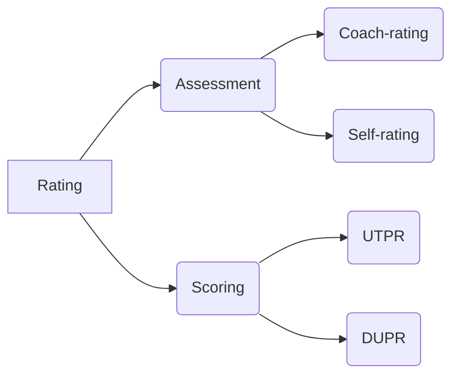

# Pickleball Rating
Types of Pickleball ratings
- assessment-based rating: **self-rating** and **coach-rating**
- score-based rating: **UTPR** and **DUPR**

## Assessment-Based Rating

Assessment-based rating refers to subjective rating assigned to a player based on skill rating defined by established organization(s), such as *USA Pickleball*   ([USAPA](https://usapickleball.org)).
- **Self-rating** refers to players assign ratings to themselves based on predefined skill rating definition.
- **Coach-rating** refers to players assign ratings by a Pickleball coach the coach's knowledge and predefined skill rating definition.

#### Skill Rating Definition
- [USAPA Definitions of Player Skill Ratings](https://usapickleball.org/tournaments/tournament-player-ratings/player-skill-rating-definitions/)
- [USAPA Player Skill Rating Definitions](https://usapickleball.org/wp-content/uploads/2020/07/USAPA-Skill-Rating-Definitions-2020.pdf)
- USA Pickleball [USAP](https://usapickleball.org/)

## Score-Based Rating
A score-based rating refers to quantitative ratings assigned to players based on their game scores. Two major organizations provide score-based ratings: *USA Pickleball Tournament Player Rating* [(UTPR)](https://usapickleball.org/tournaments/tournament-player-ratings) and *Dynamic Universal Pickleball Rating* [(DUPR)](https://mydupr.com/). 

- **UTPR** provides ratings for players who play in UTPR affiliated **tournaments**.  
- **DUPR** provides ratings for players who play in [DUPR](https://mydupr.com) and [PPA](https://www.ppatour.com) affiliated **tournaments**, as well as players who submit their scores of **any game** to DUPR.  

## Resources
- [USA Pickleball (USAPA)](https://usapickleball.org)
- [USA Pickleball Tournament Player Rating (UTPR)](https://usapickleball.org/tournaments/tournament-player-ratings)
- [Dynamic Universal Pickleball Rating (DUPR)](https://mydupr.com)
- [Professional Pickleball Association (PPA)](https://www.ppatour.com)
- [Pickleball Ratings, Skill Levels and Rankings | Pickler Pickleball](https://thepickler.com/blogs/pickleball-blog/pickleball-ratings-skill-levels-rankings) 