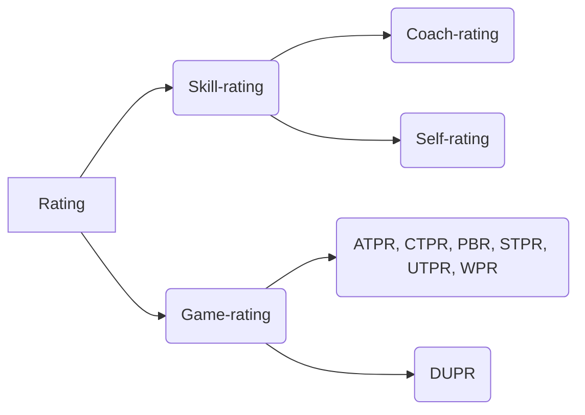

# Pickleball Rating
Types of Pickleball ratings
- **Skill-rating**: self-rating or coach-rating
- **Game-rating**: UTPR, IPTPA or DUPR

## Skill-Rating

Skill-rating refers a subjective rating of a player's skill level, typically based  Pickleball skill assessment guidelines defined by an established organization, such as [USAPA](https://usapickleball.org/tournaments/tournament-player-ratings) or [IPTPA](https://iptpa.com).  There are two types of skill-rating: 

- **Self-rating** refers to players assign ratings to themselves based on predefined skill rating guidelines.
- **Coach-rating** refers to players assign ratings by a Pickleball coach the coach's knowledge and predefined skill rating guidelines.

#### Skill Rating Guidelines
- [USAPA Definitions of Player Skill Ratings](https://usapickleball.org/tournaments/tournament-player-ratings/player-skill-rating-definitions/)
- [USAPA Player Skill Rating Definitions](https://usapickleball.org/wp-content/uploads/2020/07/USAPA-Skill-Rating-Definitions-2020.pdf)
- [IPTPA Rating Skills Assessment](https://iptpa.com/iptpa-rating-skills-assessment/)

## Game-Rating
A game-rating refers to a calculated rating of a player's accumulated game scores.  Players, who participate in tournaments affiliated with major organizations, typically receive ratings.  [(DUPR)](https://mydupr.com/) is the only organization that provide game-rating without requiring a player to play in a tournament.

### Pickleball Game Ratings
- ATPR by [Pickleball Australia](https://www.pickleballaus.org/)
- CTPR by [Pickleball Canada](https://pickleballcanada.org/)
- DUPR by [mydupr.com](https://mydupr.com/)
- PBR: by [PickleballBrackets.com](https://pickleballbrackets.com)
- STPR by [US Senior Pickleball](https://www.usseniorpickleball.com/)
- UTPR by [USA Pickleball](https://usapickleball.org)
- WPR by [PickleballTournaments.com](https://www.pickleballtournaments.com/)

## Resources
- [USA Pickleball (USAPA)](https://usapickleball.org)
- [USA Pickleball Tournament Player Rating (UTPR)](https://usapickleball.org/tournaments/tournament-player-ratings)
- [Dynamic Universal Pickleball Rating (DUPR)](https://mydupr.com)
- [Professional Pickleball Association (PPA)](https://www.ppatour.com)
- [Pickleball Ratings, Skill Levels and Rankings | Pickler Pickleball](https://thepickler.com/blogs/pickleball-blog/pickleball-ratings-skill-levels-rankings)
- [IPTPA](https://iptpa.com)